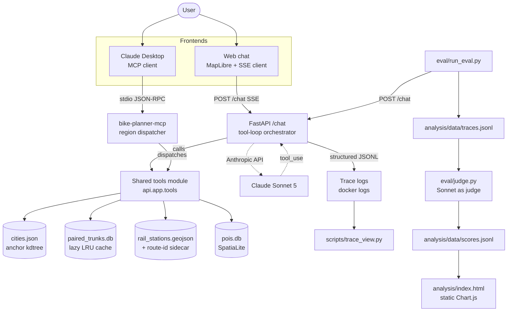

# Bike Routing — an AI-native tour planner

> Ask a chat agent to plan a 4,000 km bike tour with rail-accessible
> overnights, then watch the map paint the plan while the agent
> compares routes, hunts for train stations, and enriches your daily
> stages with nearby destinations. Every planning decision is a tool
> call you can see.


## What this is (portfolio version)

I built this as a demonstration of the skills required for a data-
scientist-to-AI-engineer transition. The routing engine is
DS-flavoured — a custom paired-SPT preprocess over OpenStreetMap
graphs of Austria, Czechia, Germany and Denmark — but the *product*
around it is an agent: a Claude Sonnet–driven planner that uses a
half-dozen tools to compose a bikeable multi-day itinerary.

### Architecture



### Skills demonstrated (DS → AI engineer)

| Competency | Where in this repo |
|---|---|
| **LLM tool design** | `api/app/tools.py` — 8 tools with input schemas + description patterns tuned via eval (see the "USE THIS whenever…" hint in `direct_rail_service` which fixed a real 2 → 4 rubric jump). |
| **Prompt engineering as system design** | `api/app/chat.py::SYSTEM_PROMPT` — workflow rules, reformat/recall handling, and an anti-fabrication rule that produced a measurable grounding fix. |
| **Agent-loop orchestration** | The tool-use loop in `_run_chat_inner` — streams SSE, injects tool_results back into the messages array, strips thinking blocks (they don't round-trip), caps rounds. |
| **Streaming SSE + robust integration** | Client-side offline detection, per-request timeout, mid-stream error surfaces without crashing the socket. |
| **Model Context Protocol (MCP)** | `mcp_server/` — stdio JSON-RPC server exposing the same 8 tools to Claude Desktop, with a `Dispatcher` designed for future geographic sharding via `REGION_AWARE_TOOLS`. |
| **LangGraph comparison** | `experiment/langchain-chat` branch — same tool set as a `StateGraph` with Send-based fan-out and per-node reducers; writeup in `NOTES/langchain-comparison.md`. |
| **Eval-driven development** | `eval/` + `analysis/` — a gold-prompt suite, an LLM-as-judge scoring loop, and a static Chart.js dashboard. Bugs #5 and #6 were both fixed by re-running the eval and reading the judge rationales. |
| **Observability** | `api/app/tracing.py` + `scripts/trace_view.py` — structured JSONL events with per-round `usage.input_tokens`, per-tool latency; docker-logs is the transport, no new sink. |
| **Production readiness patterns** | Lazy-load with an LRU cache (`trunk_router._TrunkStore`) for the 5 GB → 300 MB reduction that made the flagship runnable on a laptop; CI syntax check + FastAPI import smoke + Docker build + MCP dispatcher tests. |
| **Data engineering underneath** | Custom OSM PBF ingest, paired-SPT preprocess with per-anchor kdtree slicing, GTFS multi-feed dedup with sibling-platform clustering, station-line proximity filter that recovered Denmark's ingest after a broken feed. |

### Deployment note

The bike-api container's steady-state RSS is now ~300 MB (down from
~5 GB — see `f2fa513`). A 1 vCPU / 2 GB VM will run the app fine
including postgres + the paired-trunk lazy cache. What DOESN'T fit
in a small VM is the preprocess pipeline — the four-country OSM PBF
ingest peaks at ~10 GB working set and takes ~3 hours on a beefy
box. Ship the DB artifacts (`data/spt/…/paired_trunks.db`,
`data/rail_stations.geojson`, etc.) to the small VM and let it
serve.

**What's demonstrated**

- **Tool use as UX.** Custom tools (`route`, `stations_along_route`,
  `pois_near_anchor`, `split_into_stages`, …) designed to *steer* the
  model to good decisions in few round-trips instead of running away
  in a per-candidate loop. See `NOTES/tool-design.md` for the
  before/after story.
- **Streaming SSE + robust API integration** — the agent's plan
  arrives incrementally, tool call by tool call, with client-side
  offline detection, per-request timeout, and idle-watchdog abort.
- **Prompt engineering as system design** — the system prompt
  explicitly separates "compose a plan" from "reformat a plan
  already produced" so a "make it a table" turn doesn't re-run the
  route.
- **MCP server** (Phase 3) — the same tools also expose over
  Anthropic's Model Context Protocol so Claude Desktop can drive
  the planner without the web UI.
- **Multi-agent orchestration** (Phase 4) — a LangGraph fork with
  a planner → router → per-stage enricher (parallel fan-out) →
  composer → critic loop, benchmarked side-by-side with the native
  single-agent SDK on the same prompt. Written up in
  `NOTES/langchain-comparison.md`.
- **Evaluation harness + observability dashboard** (Phases 5-6) —
  gold prompt set, LLM-as-judge scoring, JSONL trace log, static
  Chart.js dashboard for cost/latency/quality by backend.

**What's underneath** — the routing engine itself is described in
`NOTES/routing-engine.md`: multi-source Dijkstra chain graphs,
proximity-based detour filtering, per-anchor SPT polygon bounds,
paired-trunk SQLite blobs. Sub-second query time for 1,500 km routes.

---

## Live demo prompts

Once you're at the running app (see quickstart below), try:

```
Route Graz to Vienna, split into 3-day stages, ~80 km/day. Enrich
each riding day with 2-3 viewpoints within 2 km of the route.
```

```
30 days Graz → Copenhagen, 2-3 days in major cities, ~50 mi/day,
rail-accessible overnights.
```

Watch the map fill in as the agent iterates. Toggle "Show route data"
in the left overlays panel to see the paired-SPT polygons the router
walked underneath.

---

## Eval harness

`eval/` runs the agent against a gold-prompt suite (a flagship
Graz→Copenhagen 50-day plan plus six fast smoke prompts) and pipes the
traces through a Sonnet judge that scores each per-prompt rubric.
Everything writes to plain JSONL under `analysis/data/`; the dashboard
at `analysis/index.html` is a static Chart.js page you can open with
`file://` — no notebook, no server.

```
# start the api first, then
pip install -r eval/requirements.txt
python3 eval/run_eval.py             # → analysis/data/traces.jsonl
python3 eval/judge.py                # → analysis/data/scores.jsonl
open analysis/index.html
```

Prompts and rubric axes live in `eval/gold_prompts.yaml`. Add a new
prompt with a rubric section and re-run — the dashboard picks it up
automatically. Cost per full run is ~$3–5 (Sonnet as both the planner
and the judge).

---

## Observability

`/chat` emits a structured trace event per request/round/tool_call to
stdout as `[chat-trace] {...json...}` lines. Docker captures them, so
`docker logs bike-api` is the transport — no new sink to configure.

Render one request's timeline as a tree:

```
docker logs bike-api 2>&1 | python3 scripts/trace_view.py --last
```

or pick a specific request by id:

```
docker logs bike-api 2>&1 | python3 scripts/trace_view.py --list
docker logs bike-api 2>&1 | python3 scripts/trace_view.py \
    --request-id a3f7b1c2
```

Each round line carries `latency_ms` + Anthropic-reported
`usage.input_tokens`/`output_tokens`, so cost per request is a
straight sum against Sonnet pricing. Tool_call lines carry per-call
`latency_ms` too, which is how the "cold blob load takes 3–5 s on a
novel corridor" claim in the lazy-load commit was measured.

Event schema is stable — see `api/app/tracing.py`. Downstream sinks
(OpenTelemetry, Langfuse) can hook in by adding another `_emit`
target in that module.

---

## Original project name

A self-supported bike-tour planner for the Graz → Copenhagen corridor.
OpenStreetMap data + a Postgres/pgRouting-backed SPT preprocess + scenic
POI overlays. Dockerized.

## Services

| Service     | Stack                                       | Notes                                                 |
|-------------|---------------------------------------------|-------------------------------------------------------|
| ingest      | Python + osmium + SpatiaLite                | One-shot PBF + POI + GTFS download                    |
| postgres    | PostGIS + pgRouting (16-3.5-3.7.3)          | Road graph + landcover + railways during preprocess   |
| pgrouting   | Python + psycopg + pyosmium                 | Paired-SPT preprocess + GTFS route-id sidecar         |
| api         | Python + FastAPI + Anthropic SDK            | /chat SSE tool loop, /tools/*, /trunk/route, /pois    |
| web         | nginx + MapLibre GL JS                      | Chat UI + map + debug overlays                        |
| mcp_server  | Python + `mcp` SDK                          | stdio JSON-RPC for Claude Desktop; region dispatcher  |

The routing pipeline is two-stage:
- **Preprocess** (pgrouting service): stream PBFs into Postgres, snap
  `place=city|town` anchors to graph vertices, run a paired-SPT walk
  per anchor pair (chainless, 30 km uniform SPTs with `is_frontier`
  byproduct; ferry chain edges added as a post-step). Output is a
  SQLite `paired_trunks.db` blob store keyed by `(src_city, dst_city)`,
  plus `cities.json` and `city_graph.json` for the small chain graph.
- **Query** (api service): given start/end anchors, plan a city
  sequence via Dijkstra on the chain graph, then walk each edge's
  trunk from `paired_trunks.db` (lazy-loaded via LRU — see
  `trunk_router._TrunkStore`). Warm queries ~100 ms; a novel corridor
  pays a one-time 3–5 s mmap page-in on first hit.

The corridor data comes from **Geofabrik** country PBFs (Austria,
Czech Republic, Germany, Denmark). GTFS feeds come from the
respective national aggregators; only the rail portion is kept
(bus routes at rail-served stations are recorded as `n_routes_bus`
context but never used for routing).

## Prerequisites

- Linux host with Docker + Docker Compose (works on WSL2). About 10 GB
  free disk for the full corridor.
- Your user must be in the `docker` group:
  ```sh
  sudo usermod -aG docker $USER
  # Log out + back in (or open a new shell), then verify:
  docker ps
  ```

---

## Phase 1 — data ingest

Downloads OSM PBFs and extracts POIs + routing anchors into a
SpatiaLite database.

### Smoke test (Austria only, ~700 MB)

```sh
cd /path/to/bike
docker compose run --rm ingest --test
```

Downloads Austria PBF (~700 MB), extracts POIs and `place=city|town`
anchors, builds `data/pois/pois.sqlite`. Idempotent — reruns skip
cached files.

### Full corridor (~7 GB)

```sh
docker compose run --rm ingest
```

### Verify the SpatiaLite DB

```sh
docker run --rm -v "$(pwd)/data:/data" debian:bookworm-slim bash -c '
  apt-get update -qq && apt-get install -qq -y sqlite3 libsqlite3-mod-spatialite > /dev/null
  sqlite3 /data/pois/pois.sqlite "SELECT load_extension(\"mod_spatialite\"); SELECT category, COUNT(*) FROM pois GROUP BY category;"
'
```

---

## Phase 2 — SPT preprocess (pgrouting)

Brings up Postgres + the preprocess container, streams PBFs into
`ways` / `ways_vertices_pgr`, snaps anchors, runs the multi-source
Bellman-Ford wave relaxation, and materializes per-city SPTs.

### Bring up Postgres

```sh
docker compose up -d postgres
docker compose exec -u postgres postgres psql -U bike -d bike -c "
  CREATE EXTENSION IF NOT EXISTS postgis;
  CREATE EXTENSION IF NOT EXISTS pgrouting;"
docker compose exec -u postgres postgres psql -U bike -d bike \
  -f /docker-entrypoint-initdb.d/schema.sql 2>/dev/null \
  || docker compose run --rm pgrouting --help > /dev/null   # ensures image builds
```

(For now the schema is applied by hand — see `pgrouting/schema.sql`.)

### Run the preprocess

Smoke (Austria):
Subcommands (run independently):
```sh
docker compose --profile preprocess run --rm pgrouting ingest         --countries austria
docker compose --profile preprocess run --rm pgrouting snap           --countries austria
docker compose --profile preprocess run --rm pgrouting recompute-cost --profile views
```

The V4 polygon-SPT pipeline runs outside `main.py`:
```
export_cells.py                  edges → per-1°-cell .npz files
compute_anchor_spt_polygons.py   1.5-hop hull + 5 km discs per anchor
compute_spts_polygon.py          polygon-bounded multi-source Dijkstras
adapt_polygon_to_paired.py       cities.json + city_graph.json
build_polygon_paired_db.py       SQLite trunk DB consumed by the API
```

Output lands at `data/spt/<profile>/`:
```
cities.json         anchor list (city_idx, name, lon, lat, snap_vids, ...)
city_graph.json     (from_city, to_city, weight, geom) adjacency
<idx>.npz           per-anchor polygon SPT: node_global, parent, cost, coords_lonlat
paired_trunks.db    SQLite trunk DB consumed by /trunk/route
```

---

## Phase 3 — FastAPI service

A small Python service that serves bike routes and POI lookups.

```sh
docker compose up -d api
docker compose logs -f api
```

Listens on port `8000` inside the container, mapped to `8001` on the host.

### Endpoints

#### `GET /health`

```sh
curl http://localhost:8001/health
# {"status":"ok"}
```

#### `GET /trunk/route?from=lon,lat&to=lon,lat&profile=views`

Paired-trunk routing — hot-path ~25 ms. Snaps endpoints to the nearest
anchor pair, looks up the precomputed trunk path from the SQLite
trunk DB, and stitches in first/last-mile straight segments.

#### `GET /way-graph/spt/{city_idx}?profile=direct_polygon`

Per-anchor polygon-bounded SPT for visualization in the UI.

#### `GET /way-graph/spt-status?profile=direct_polygon`

Which anchor SPTs have been written so far — lets the UI light up
anchors as the overnight build progresses.

#### `GET /pois?bbox=minlon,minlat,maxlon,maxlat&category=lodging,food&limit=500`

```sh
curl 'http://localhost:8001/pois?bbox=15.3,47.0,15.6,47.2&category=viewpoint&limit=200'
```

Categories: `viewpoint`, `lodging`, `food`, `bike_service`, `water`.

---

## Phase 4 — MapLibre web UI

A static single-page app driven by the API. nginx serves it on port
`8080` and reverse-proxies `/api/*` to the FastAPI container.

```sh
docker compose up -d --build
```

Open `http://localhost:8080` (or via Tailscale,
`http://desktop-nk6flc3.tail9115a7.ts.net:8080`).


---

## Project layout

```
bike/
├── docker-compose.yml
├── README.md
├── PERF_NOTES.md
├── ingest/                # Phase 1 — OSM + POI download
│   ├── Dockerfile
│   ├── config.py
│   ├── download_osm.py
│   ├── download_util.py
│   ├── extract_pois.py    # osmium tags-filter wrapper
│   ├── build_db.py        # PBF → GeoJSON-Seq → SpatiaLite
│   └── main.py
├── pgrouting/             # Phase 2 — SQL-backed preprocess
│   ├── Dockerfile
│   ├── schema.sql         # ways, ways_vertices_pgr, anchors
│   ├── cost.py            # per-edge bike cost function (port of lht.brf semantics)
│   ├── ingest_pbf.py      # streaming PBF -> Postgres staging tables
│   ├── snap_anchors.py    # SpatiaLite anchors -> Postgres + KNN snap
│   ├── export_cells.py    # ways -> per-1°-cell .npz files
│   ├── compute_anchor_spt_polygons.py
│   ├── compute_spts_polygon.py    # polygon-bounded multi-source Dijkstra
│   ├── adapt_polygon_to_paired.py
│   ├── build_polygon_paired_db.py # SQLite trunk DB
│   ├── config.py
│   └── main.py            # ingest, snap, dem-*, landcover-*, recompute-cost, …
├── api/                   # Phase 3 — FastAPI service
│   ├── Dockerfile
│   ├── requirements.txt
│   └── app/
│       ├── main.py        # /health, /trunk/route, /pois, /tools/*, mounts /chat
│       ├── chat.py        # /chat SSE tool-loop orchestrator
│       ├── tools.py       # TOOLS + TOOL_IMPLS (shared with mcp_server)
│       ├── tracing.py     # structured [chat-trace] JSONL events
│       ├── settings.py
│       ├── geo.py
│       ├── pois.py        # SpatiaLite POI lookups
│       └── trunk_router.py  # paired-trunk lookup + lazy TrunkStore LRU
├── mcp_server/            # stdio MCP server for Claude Desktop
│   ├── mcp_bike_planner/
│   │   ├── server.py      # stdio entry
│   │   ├── dispatcher.py  # Backend protocol + region routing
│   │   └── regions.toml
│   └── tests/test_dispatcher.py
├── eval/                  # gold-prompt suite + LLM-as-judge
│   ├── gold_prompts.yaml
│   ├── run_eval.py
│   └── judge.py
├── analysis/              # static Chart.js dashboard for eval results
│   ├── index.html
│   ├── dashboard.js
│   └── style.css
├── scripts/
│   └── trace_view.py      # renders one /chat request's timeline
├── NOTES/
│   ├── demo-script.md     # 5-prompt walkthrough + screenshot checklist
│   ├── deferred.md        # sidebar features archived pre-portfolio pivot
│   └── langchain-comparison.md  # experiment/langchain-chat writeup
├── web/                   # Phase 4 — static SPA + nginx proxy
└── data/                  # populated by ingest + preprocess (gitignored)
    ├── osm/      *.osm.pbf
    ├── pois/     *.osm.pbf, pois.sqlite
    ├── gtfs/     *-gtfs.zip
    ├── rail_stations.geojson
    ├── rail_station_routes.json   # route-id sidecar for direct_rail_service
    └── spt/      <profile>/(cities.json, city_graph.json, paired_trunks.db)
```

## Port bindings

Port bindings use `0.0.0.0` so they're reachable on any interface.

| Port  | Service              |
|-------|----------------------|
| 8001  | FastAPI (8000 in container) |
| 8080  | Web UI               |
